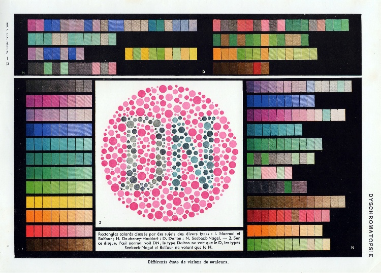
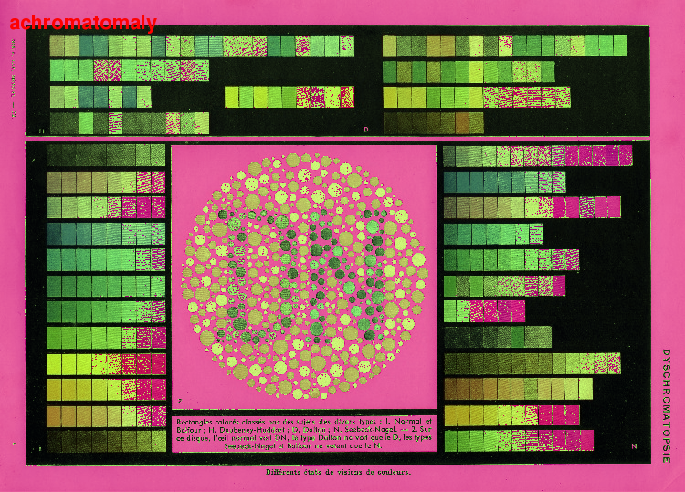
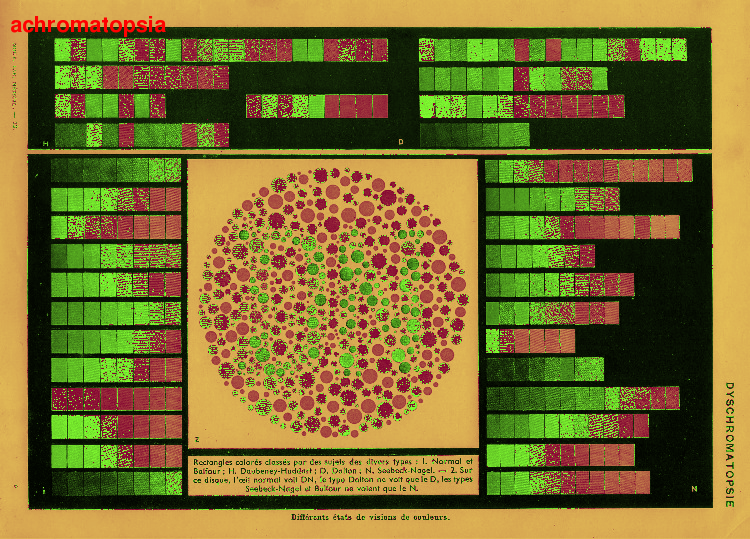
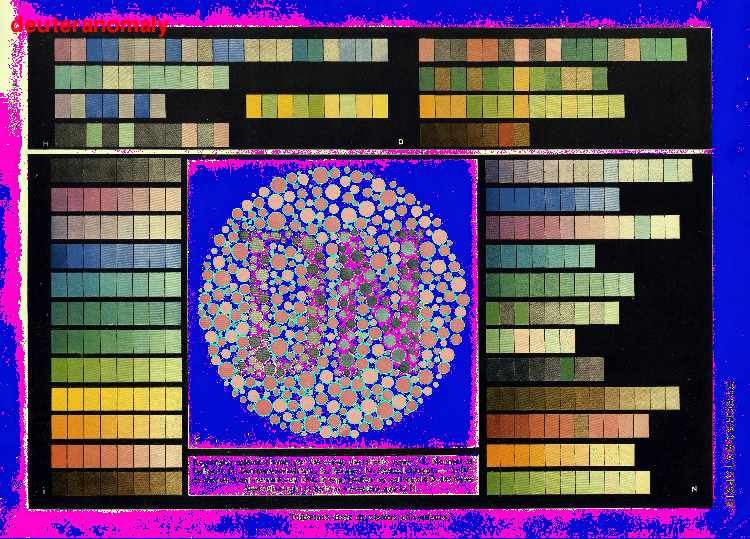
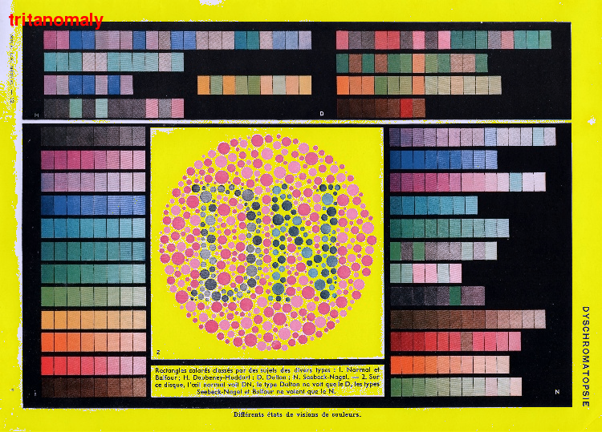
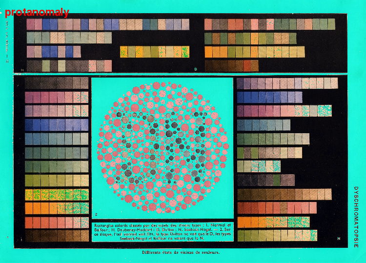
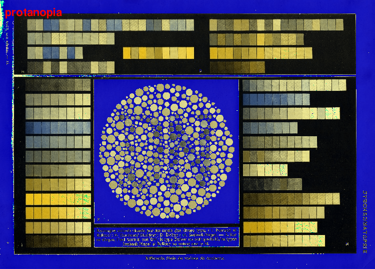

ColorBlind
==========

Playing around with color remapping to simulate color blindness. This script takes in the input image and remaps the colors to simulate how the image would look if you had a particular type of color blindness. 

The input image is a print from an old French medical text about color blindness I picked up at a flea market. I scanned it and wanted to see if I could simualte color blindness. The print is called Dyschromatopsy and is from Larousse Medicale Illustre. The print is an offset lithography from the 1952 edition, but the original printing was created in 1912. I cribbed some remapping values from [here](https://github.com/emarc/Chrometric). This kinda stuff should be done in HSV as RGB blows out the color in the white areas of the image. 

According to my French friend the print says the following:

'''
Colored rectangles classified by subjects of different types:1 normal and Balfour .... 2 on that disk, the normal eye sees "DN", the Dalton type only sees the D, the Seebeck-Nagel and Balfour types only see the N.
'''

Read more about color blindness here:
* [Wikipedia Article](http://en.wikipedia.org/wiki/Color_blindness)
* [Here is some theory as to how this all works](http://www.sewanee.edu/chem/Chem%26Art/Detail_Pages/ColorProjects_2004/Lowry/Lowry.htm)
* This is a cool ['augmented reality' app](http://dankaminsky.com/2010/12/15/dankam/) that simulates color blindness.
* This is the market where I bought [my source print](http://www.sowavintagemarket.com/home). 

Running the Code
========

Currenctly the code requires SimpleCV and NumPy, but with some massaging it could easily be done using just NumPy.

Examples
========

_Note that this is a work in progress. These are not full correct yet._
 

  

